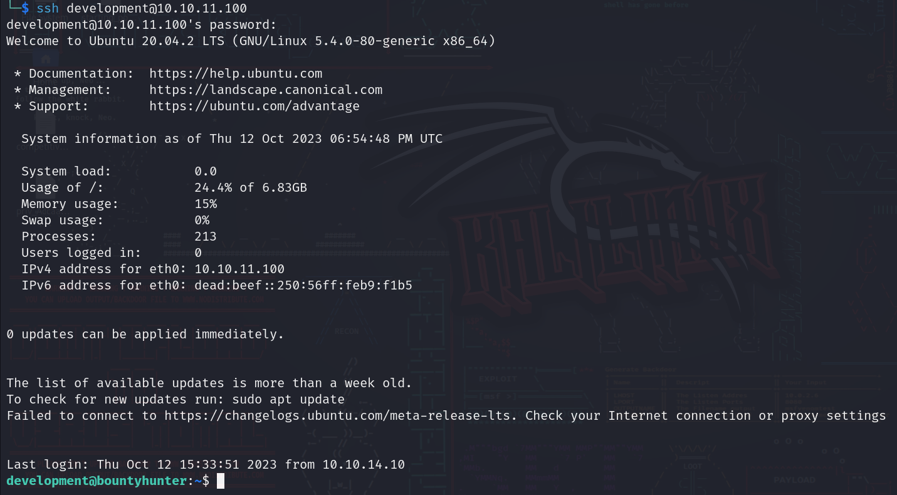

# BountyHunter machine on [hackthebox](https://app.hackthebox.com)

Written by: Mustafa Musallati.

---

### Enumeration:


nmap scan:

```
Starting Nmap 7.94 ( https://nmap.org ) at 2023-10-12 08:57 EDT
Nmap scan report for 10.10.11.100
Host is up (0.079s latency).
Not shown: 998 closed tcp ports (reset)
PORT   STATE SERVICE VERSION
22/tcp open  ssh     OpenSSH 8.2p1 Ubuntu 4ubuntu0.2 (Ubuntu Linux; protocol 2.0)
| ssh-hostkey: 
|   3072 d4:4c:f5:79:9a:79:a3:b0:f1:66:25:52:c9:53:1f:e1 (RSA)
|   256 a2:1e:67:61:8d:2f:7a:37:a7:ba:3b:51:08:e8:89:a6 (ECDSA)
|_  256 a5:75:16:d9:69:58:50:4a:14:11:7a:42:c1:b6:23:44 (ED25519)
80/tcp open  http    Apache httpd 2.4.41 ((Ubuntu))
|_http-title: Bounty Hunters
|_http-server-header: Apache/2.4.41 (Ubuntu)
Service Info: OS: Linux; CPE: cpe:/o:linux:linux_kernel

Service detection performed. Please report any incorrect results at https://nmap.org/submit/ .
Nmap done: 1 IP address (1 host up) scanned in 13.56 seconds
```


Let's check the website:


When we go to the portal we get redirected to "log_submit.php" page to submit some data, and we can see what would be added if the portal was up.


Upon further enumeration and searching we find a resources directory:


Reading the "bountylog.js" file we can see that the data that is being submitted is saved in the path "tracker_diRbPr00f314.php".


When we try to to inspect the POST request (in log_submit.php) we see that the data is sent as the following:


Base64 and url encoded, so let's decode it real quick to see how it is sent....


```
<?xml  version="1.0" encoding="ISO-8859-1"?>
		<bugreport>
		<title>test</title>
		<cwe>test</cwe>
		<cvss>test</cvss>
		<reward>test</reward>
		</bugreport>
```
It's being sent as xml, so maybe we can try xxe?


### Exploitation

So we will make the following file and will call it data.xml:


Now let's base64 encode it then url encode it (alot of websites are available online).

Here is our final result:
```
PD94bWwgIHZlcnNpb249IjEuMCIgZW5jb2Rpbmc9IklTTy04ODU5LTEiPz4KPCFET0NUWVBFIGZvbyBbIDwhRU5USVRZIHh4ZSBTWVNURU0gImZpbGU6Ly8vZXRjL3Bhc3N3ZCI%2BIF0%2BCgkJPGJ1Z3JlcG9ydD4KCQk8dGl0bGU%2BdGVzdDwvdGl0bGU%2BCgkJPGN3ZT50ZXN0PC9jd2U%2BCgkJPGN2c3M%2BdGVzdDwvY3Zzcz4KCQk8cmV3YXJkPiZ4eGU7PC9yZXdhcmQ%2BCgkJPC9idWdyZXBvcnQ%2BCgo%3D
```

Now let's send a request with the data being our final result and check the response:


And now we can read files of the system, also note that there is a user called development.


Now let's use a php filter that will let us read files encoded in base64, so the payload will be like this to read db.php file:


Again base64 encode it and url encode it then send it.


once we read it we can see that we have some credentials, remember that development user?? let's try to shh in his account using this password.



And it is!!

Now we have to start do some searching for root.

First let's see what to do with sudo:


We can execute some python script as sudo, let's try to analyze it.


If we read the script we will see that it takes a MD file and validate if it's a "valid ticket" or not, so going through the script we see different things:
1) There is certain conditions for a ticket to be valid.
2) Certain numbers must be used in the ticket.
3) There is an "eval" function used, which is considered to be insecure since we can execute code with it.

After trying and generating different tickets we finally manage to create a final ticket to grant us root shell (via spawning a bash shell in eval function).

final ticket: 

Now we perform the script as sudo and give it our ticket file path:


Done machine....

Thanks for reading!

Good hunting!! :)

---

Written by: Mustafa Musallati.
[LinkedIn](https://www.linkedin.com/in/mustafa-musallati-95a159260/)
[instagram](https://www.instagram.com/accaard/)


